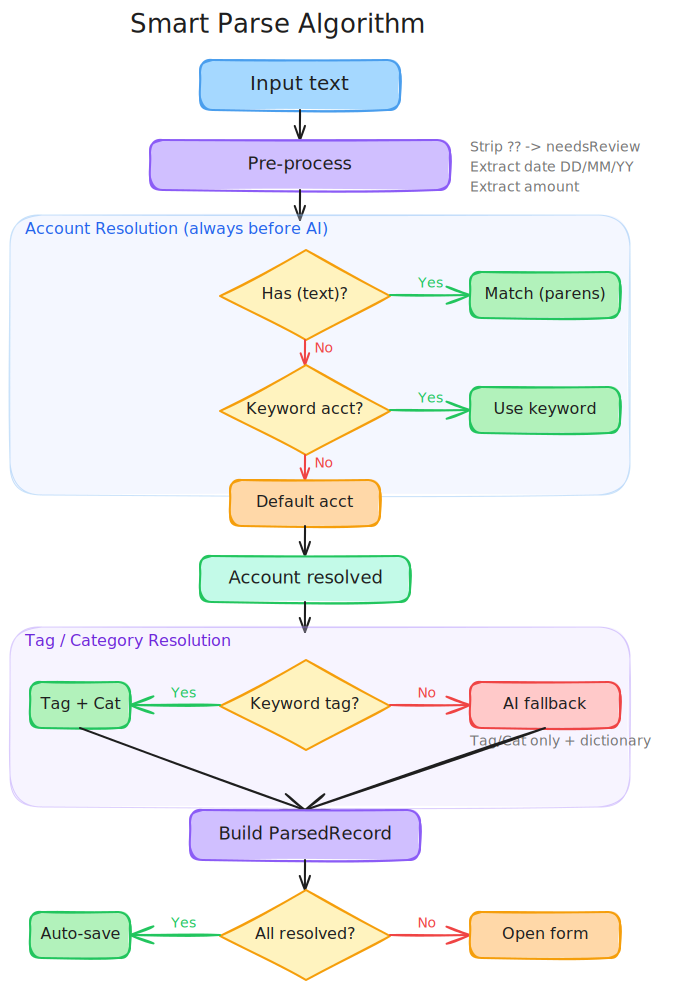

# Smart Parse Algorithm

Flowchart: [smart-parse-flowchart.excalidraw](smart-parse-flowchart.excalidraw)



## Input Syntax

| Token | Meaning | Example |
|---|---|---|
| number | amount | `11500`, `-30000`, `51144.70` |
| `(text)` | account (alias or partial name match) | `(galicia)`, `(usd)`, `(ml)` |
| `??` / `???` | needs review flag | `sbuxespejo??` |
| `DD/MM/YY` or `DD/MM` | explicit date (current year if omitted) | `16/03/26`, `16/03` |
| everything else | note / context | `mercadopago sbuxespejo` |

## Algorithm

### 1. Pre-process
- Strip `??` markers → set `needsReview: true`
- Extract `(account)` from parentheses
- Extract date if present (DD/MM/YY or DD/MM → use current year)
- Extract amount (last standalone number)
- Remaining text = note (always preserved in full)

### 2. Account Resolution (always before AI)
1. `(parens)` → match against account **aliases** (exact) then **names** (partial). If no match, text goes back to note.
2. Note words → match against aliases then names (e.g. "reintegro galicia" → Galicia ARS via "galicia" alias)
3. Keyword mappings → learned accountId from feedback
4. Default → explicit `isDefault` account, or most-used account (most records)

### 3. Tag / Category Resolution
1. **Tag name match** — exact first, then partial (contains). "uber" → Uber, "super" → Supermercado, "farm" → Farmacia. Brand names like "carrefour" won't match (no tag with that name).
2. **Keyword mappings** → learned tagId from feedback (e.g. "carrefour" → Supermercado)
3. If tag found → auto-assign its parent category
4. <!-- TODO: people detection → match note words against people table, use defaultTagId if set -->
5. If no tag found → **AI fallback** (tag/category only, account already resolved)
   - AI receives keyword dictionary as compact context

### 4. Result
All parsed records open the edit/review modal (training phase). Once keyword dictionary has enough data, auto-save can be re-enabled for high-confidence matches.

## Keyword Dictionary

The `keyword_mappings` table learns from corrections:
- When user corrects a parsed record, keywords from the input text are upserted with the corrected tagId/accountId
- Only auto-maps keywords when the note is 1-2 words (brands/stores like "uber", "carrefour")
- Multi-word notes are too ambiguous for single-word mapping — people detection will handle those cases
- Keywords must be 3+ characters, non-numeric

## Resolution Priority

```
Amount + Date + needsReview       (deterministic extraction, amount always absolute)
         ↓
Account: (parens) → note words → keyword map → default (isDefault or most records)
         matches aliases first, then names
         ↓
Tag:     tag name (exact → partial) → keyword map → [people w/ defaultTag] → AI fallback
         ↓
Person:  [match against people table, even without defaultTag]

[ ] = planned, not yet implemented
```

## Examples

```
uber 3327                                → amount=3327, tag=Uber (direct name match)
uber muniz 3500 (galicia)                → amount=3500, account=Galicia ARS (alias), note="uber muniz"
uber 3500 (usd)                          → amount=3500, account=Galicia USD (alias), tag=Uber
uber 3500 (ml)                           → amount=3500, account=MercadoLibre (alias), tag=Uber
supermercado 11500                       → amount=11500, tag=Supermercado (direct name match)
mercadopago sbuxespejo?? 11500 (galicia) → amount=11500, account=Galicia ARS, needsReview=true
reintegro galicia 127                    → amount=127, account=Galicia ARS (alias in note), tag via AI/keyword
51144.70 pizzas urban jazz               → amount=51144.70, note="pizzas urban jazz"
tranf a gustavo -30000                   → amount=30000 (absolute), note="tranf a gustavo"
exchange 150usd 204750                   → amount=204750, note="exchange 150usd"
carrefour 4386.85 16/03                  → amount=4386.85, date=2026-03-16, tag via keyword/AI
uber 3500                                → amount=3500, account=default, tag=Uber (direct name match)
```
